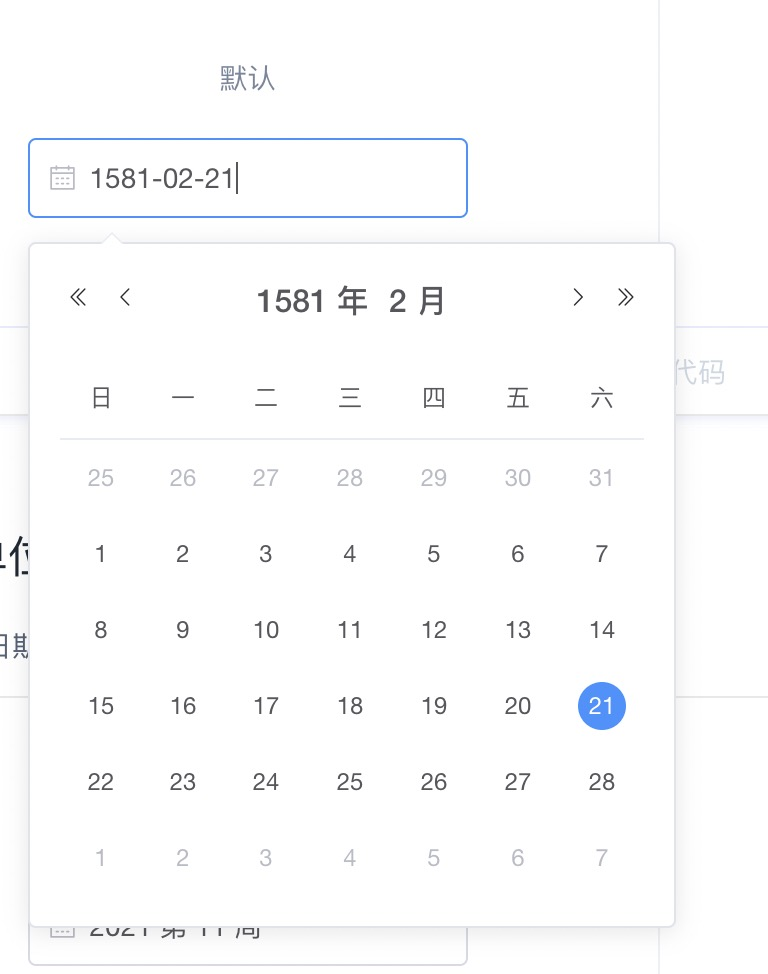
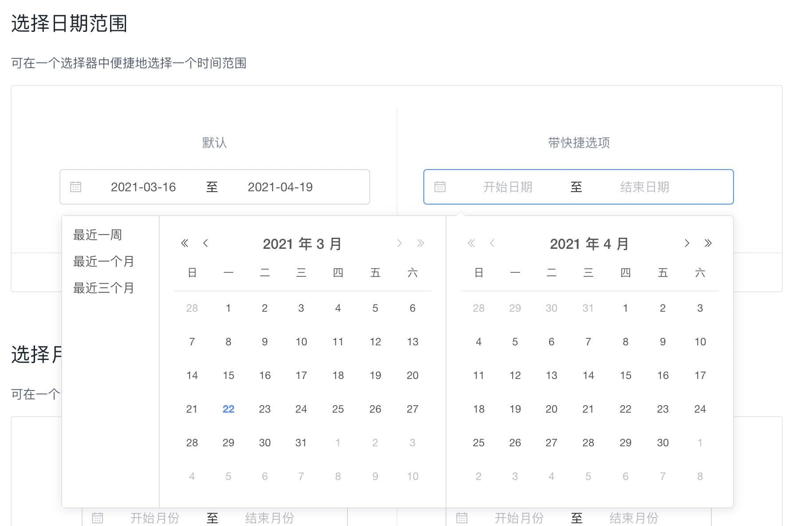
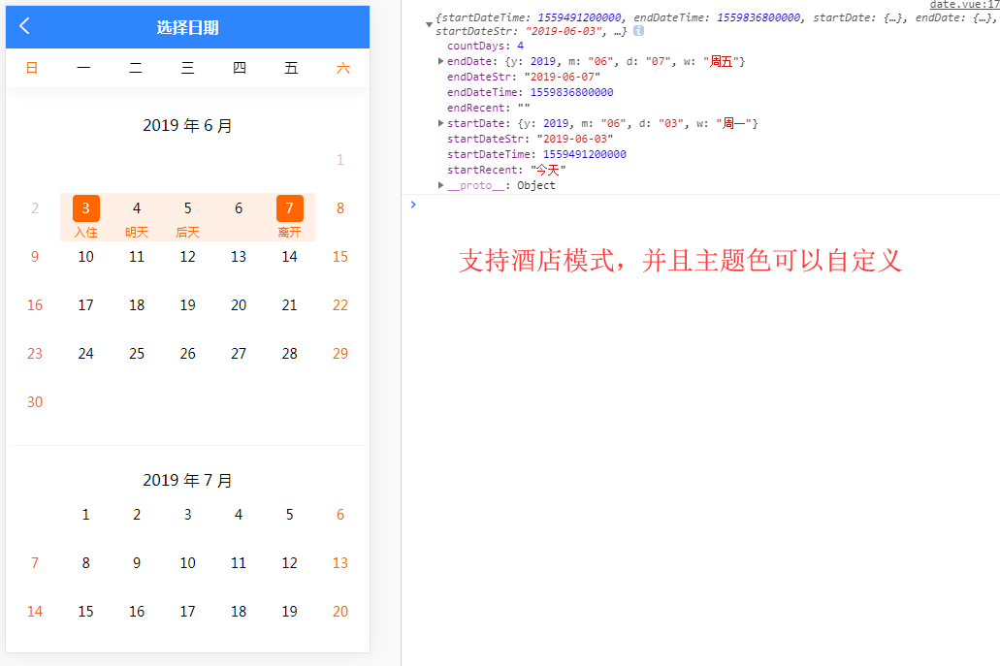

# DatePicker 时间选择器
> 代码块： `uDatePicker`

## 基本用法

### pc上的展示效果

### 手机上展示效果

## API

### DatePicker Props

|属性名				|类型			|默认值		|值域																		|说明							|
|:-:				|:-:			|:-:		|																			|:-:							|
|type				|String			|datetime	|year/month/date/dates/ week/datetime/datetimerange/ daterange/monthrange	|选择器类型						|
|value				|String、Number	|-			|-																			|绑定值							|
|format				|String			|yyyy-MM-dd	|-																			|显示在输入框中的格式			|
|placeholder		|String			|-			|-																			|非范围选择时的占位内容			|
|start-placeholder	|String			|-			|-																			|范围选择时开始日期的占位内容	|
|end-placeholder	|String			|-			|-																			|范围选择时结束日期的占位内容	|
|return-type		|String			|timestamp	|timestamp 、string															|返回值格式						|
|border				|Boolean、String|true		|																			|是否有边框						|
|disabled			|Boolean、String|false		|																			|是否不可选择					|

注：如 type 为 time 类型，无对应的时间戳，则返回值格式 return-type 无论为何值，都会返回 string

### DatePicker Events

|事件名称	|说明												|返回值	|
|:-:		|:-:												|:-:	|
|change		|确定日期时间时触发的事件，参数为当前选择的日期对象	|-		|

补充：

- 手机显示起始日期
- 当前日期下划线，及动画